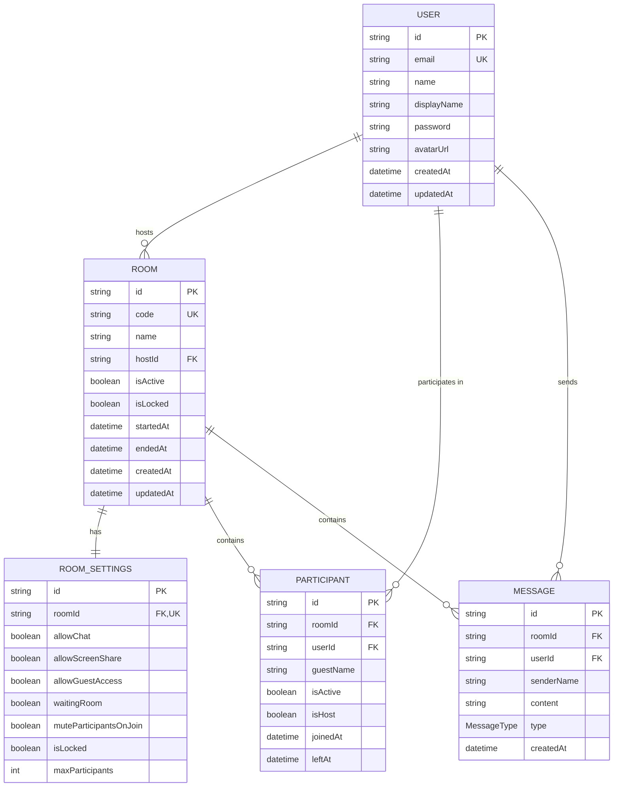

## Overview

Neuron Meet uses PostgreSQL as its primary database with Prisma as the ORM. The schema defines five main models for managing users, rooms, participants, messages, and room settings.

**Schema Location**: server/prisma/schema.prisma

## Database Configuration

**Prisma Configuration**: server/prisma/schema.prisma:4-12

```prisma
generator client {
  provider = "prisma-client-js"
}

datasource db {
  provider  = "postgresql"
  url       = env("DATABASE_URL")
  directUrl = env("DIRECT_URL") // Optional: for Supabase migrations
}
```

<Info>
The schema supports both connection pooling (`DATABASE_URL`) and direct connections (`DIRECT_URL`) for optimal Supabase compatibility.

**Reference**: .env.example:1-11
</Info>

## Data Models

### Entity Relationship Diagram



## User Model

Stores user accounts and authentication information.

**Schema**: server/prisma/schema.prisma:14-29

```prisma
model User {
  id           String        @id @default(cuid())
  email        String        @unique
  name         String
  displayName  String?
  password     String
  avatarUrl    String?
  createdAt    DateTime      @default(now())
  updatedAt    DateTime      @updatedAt
  
  hostedRooms  Room[]        @relation("HostedRooms")
  participants Participant[]
  messages     Message[]
  
  @@index([email])
}
```

### Fields

| Field | Type | Required | Description |
|-------|------|----------|-------------|
| `id` | String | Yes | Unique identifier (CUID) |
| `email` | String | Yes | Email address (unique) |
| `name` | String | Yes | Full name |
| `displayName` | String | No | Display name in meetings |
| `password` | String | Yes | Bcrypt hashed password |
| `avatarUrl` | String | No | Profile picture URL |
| `createdAt` | DateTime | Auto | Account creation timestamp |
| `updatedAt` | DateTime | Auto | Last update timestamp |

### Relationships

- **hostedRooms**: Rooms created by this user (one-to-many)
- **participants**: Participant records for this user (one-to-many)
- **messages**: Messages sent by this user (one-to-many)

### Indexes

- `email`: Index for fast login lookups

<Note>
Passwords are hashed using bcrypt before storage. The `password` field never contains plaintext.

**Reference**: server/package.json:30 (bcrypt dependency)
</Note>

## Room Model

Represents a meeting room.

**Schema**: server/prisma/schema.prisma:31-50

```prisma
model Room {
  id           String        @id @default(cuid())
  code         String        @unique
  name         String
  hostId       String
  isActive     Boolean       @default(true)
  isLocked     Boolean       @default(false)
  startedAt    DateTime      @default(now())
  endedAt      DateTime?
  createdAt    DateTime      @default(now())
  updatedAt    DateTime      @updatedAt
  
  host         User          @relation("HostedRooms", fields: [hostId], references: [id])
  settings     RoomSettings?
  participants Participant[]
  messages     Message[]
  
  @@index([code])
  @@index([hostId])
}
```

### Fields

| Field | Type | Required | Default | Description |
|-------|------|----------|---------|-------------|
| `id` | String | Yes | cuid() | Unique identifier |
| `code` | String | Yes | - | Unique room code for joining |
| `name` | String | Yes | - | Room name |
| `hostId` | String | Yes | - | User ID of room creator |
| `isActive` | Boolean | Yes | true | Whether room is active |
| `isLocked` | Boolean | Yes | false | Whether room is locked |
| `startedAt` | DateTime | Yes | now() | Room start time |
| `endedAt` | DateTime | No | null | Room end time |
| `createdAt` | DateTime | Auto | now() | Creation timestamp |
| `updatedAt` | DateTime | Auto | - | Last update timestamp |

### Relationships

- **host**: User who created the room (many-to-one)
- **settings**: Room settings (one-to-one)
- **participants**: Participants in the room (one-to-many)
- **messages**: Chat messages in the room (one-to-many)

### Indexes

- `code`: Index for fast room lookup by code
- `hostId`: Index for querying user's rooms

<Info>
Room codes are unique identifiers used in URLs (e.g., `/join/abc-def-ghi`). The signaling service validates room codes during join.

**Reference**: server/src/signaling/signaling.service.ts:40-42
</Info>

## RoomSettings Model

Configures room behavior and permissions.

**Schema**: server/prisma/schema.prisma:52-64

```prisma
model RoomSettings {
  id                     String  @id @default(cuid())
  roomId                 String  @unique
  allowChat              Boolean @default(true)
  allowScreenShare       Boolean @default(true)
  allowGuestAccess       Boolean @default(true)
  waitingRoom            Boolean @default(false)
  muteParticipantsOnJoin Boolean @default(false)
  isLocked               Boolean @default(false)
  maxParticipants        Int     @default(100)
  
  room Room @relation(fields: [roomId], references: [id], onDelete: Cascade)
}
```

### Fields

| Field | Type | Default | Description |
|-------|------|---------|-------------|
| `id` | String | cuid() | Unique identifier |
| `roomId` | String | - | Foreign key to Room (unique) |
| `allowChat` | Boolean | true | Enable chat feature |
| `allowScreenShare` | Boolean | true | Enable screen sharing |
| `allowGuestAccess` | Boolean | true | Allow guests without accounts |
| `waitingRoom` | Boolean | false | Enable waiting room |
| `muteParticipantsOnJoin` | Boolean | false | Auto-mute new participants |
| `isLocked` | Boolean | false | Lock room (duplicate of Room.isLocked) |
| `maxParticipants` | Int | 100 | Maximum participant limit |

### Relationships

- **room**: Associated room (one-to-one, cascade delete)

### Cascade Delete

When a room is deleted, its settings are automatically deleted.

**Reference**: server/prisma/schema.prisma:63 (`onDelete: Cascade`)

<Tip>
The `maxParticipants` setting is validated during room join to prevent overcrowding.

**Reference**: server/src/signaling/signaling.service.ts:104-107
</Tip>

## Participant Model

Tracks participants in rooms (for history and analytics).

**Schema**: server/prisma/schema.prisma:66-81

```prisma
model Participant {
  id         String    @id @default(cuid())
  roomId     String
  userId     String?
  guestName  String?
  isActive   Boolean   @default(true)
  isHost     Boolean   @default(false)
  joinedAt   DateTime  @default(now())
  leftAt     DateTime?
  
  room Room  @relation(fields: [roomId], references: [id], onDelete: Cascade)
  user User? @relation(fields: [userId], references: [id])
  
  @@index([roomId])
  @@index([userId])
}
```

### Fields

| Field | Type | Required | Default | Description |
|-------|------|----------|---------|-------------|
| `id` | String | Yes | cuid() | Unique identifier |
| `roomId` | String | Yes | - | Foreign key to Room |
| `userId` | String | No | null | Foreign key to User (null for guests) |
| `guestName` | String | No | null | Name for guest participants |
| `isActive` | Boolean | Yes | true | Whether participant is currently in room |
| `isHost` | Boolean | Yes | false | Whether participant is the host |
| `joinedAt` | DateTime | Yes | now() | Join timestamp |
| `leftAt` | DateTime | No | null | Leave timestamp |

### Relationships

- **room**: Associated room (many-to-one, cascade delete)
- **user**: Associated user if authenticated (many-to-one, optional)

### Indexes

- `roomId`: Fast lookup of room participants
- `userId`: Fast lookup of user's participation history

<Info>
Participant records are created when joining and persist for analytics. The `isActive` field tracks whether they're currently in the room.

**Reference**: server/src/signaling/signaling.service.ts:130-138
</Info>

### Guest vs. Authenticated Participants

- **Authenticated**: `userId` is set, `guestName` is null
- **Guest**: `userId` is null, `guestName` contains display name

```typescript
// Example: Creating participant record
await this.prisma.participant.create({
  data: {
    roomId: room.id,
    userId: userId,           // null for guests
    guestName: userId ? null : displayName,  // set for guests
    isHost,
  },
});
```

## Message Model

Stores chat messages in rooms.

**Schema**: server/prisma/schema.prisma:83-97

```prisma
model Message {
  id         String      @id @default(cuid())
  roomId     String
  userId     String?
  senderName String?
  content    String
  type       MessageType @default(TEXT)
  createdAt  DateTime    @default(now())
  
  room Room  @relation(fields: [roomId], references: [id], onDelete: Cascade)
  user User? @relation(fields: [userId], references: [id])
  
  @@index([roomId])
  @@index([createdAt])
}
```

### Fields

| Field | Type | Required | Default | Description |
|-------|------|----------|---------|-------------|
| `id` | String | Yes | cuid() | Unique identifier |
| `roomId` | String | Yes | - | Foreign key to Room |
| `userId` | String | No | null | Foreign key to User (null for system messages) |
| `senderName` | String | No | null | Display name of sender |
| `content` | String | Yes | - | Message content |
| `type` | MessageType | Yes | TEXT | Message type |
| `createdAt` | DateTime | Yes | now() | Message timestamp |

### Relationships

- **room**: Associated room (many-to-one, cascade delete)
- **user**: Associated user if authenticated (many-to-one, optional)

### Indexes

- `roomId`: Fast lookup of room messages
- `createdAt`: Chronological ordering of messages

### MessageType Enum

**Schema**: server/prisma/schema.prisma:99-103

```prisma
enum MessageType {
  TEXT
  SYSTEM
  FILE
}
```

| Type | Description |
|------|-------------|
| `TEXT` | Regular chat message from user |
| `SYSTEM` | System notification (e.g., "User joined") |
| `FILE` | File attachment (future feature) |

<Note>
Messages are retrieved when joining a room (limited to last 50).

**Reference**: server/src/signaling/signaling.service.ts:141-154

```typescript
const messages = await this.prisma.message.findMany({
  where: { roomId: room.id },
  orderBy: { createdAt: "asc" },
  take: 50,
  include: {
    user: {
      select: {
        id: true,
        name: true,
        displayName: true,
      },
    },
  },
});
```
</Note>

## Database Operations

### Creating a Room

Example Prisma query for creating a room with settings:

```typescript
const room = await prisma.room.create({
  data: {
    code: generateRoomCode(),
    name: "Team Meeting",
    hostId: userId,
    settings: {
      create: {
        allowChat: true,
        allowScreenShare: true,
        maxParticipants: 50,
      },
    },
  },
  include: {
    settings: true,
  },
});
```

### Joining a Room

Validation and participant creation:

**Reference**: server/src/signaling/signaling.service.ts:39-138

```typescript
// Verify room exists and is active
const room = await this.prisma.room.findUnique({
  where: { code: roomCode },
  include: { settings: true },
});

if (!room) {
  throw new Error("Room not found");
}

if (!room.isActive) {
  throw new Error("Room is no longer active");
}

if (room.isLocked) {
  throw new Error("Room is locked");
}

// Add participant to database
await this.prisma.participant.create({
  data: {
    roomId: room.id,
    userId: userId,
    guestName: userId ? null : displayName,
    isHost,
  },
});
```

### Retrieving Room History

Query user's rooms:

```typescript
const rooms = await prisma.room.findMany({
  where: {
    hostId: userId,
    isActive: true,
  },
  include: {
    settings: true,
    participants: {
      where: { isActive: true },
    },
  },
  orderBy: {
    startedAt: 'desc',
  },
});
```

## Migrations

Prisma handles schema migrations via the Prisma CLI.

**Scripts**: server/package.json:15-18

```json
{
  "db:generate": "prisma generate",
  "db:push": "prisma db push",
  "db:migrate": "prisma migrate dev",
  "db:studio": "prisma studio"
}
```

### Development Workflow

1. **Modify schema**: Edit `server/prisma/schema.prisma`
2. **Create migration**: `npm run db:migrate`
3. **Generate client**: `npm run db:generate`
4. **View data**: `npm run db:studio`

<Tip>
Use `db:push` for rapid prototyping (no migration files). Use `db:migrate` for production to maintain migration history.
</Tip>

## Data Retention

### Cascade Deletes

All child records are automatically deleted when parent is deleted:

- Deleting a **Room** deletes:
  - RoomSettings
  - Participants
  - Messages

- Deleting a **User** does NOT cascade (preserves room history)
  - Messages retain `senderName` even if user deleted
  - Participants retain historical record

### Soft Deletes

The schema does not implement soft deletes. Consider adding `deletedAt` fields for:
- Preserving room history
- User account recovery
- Audit trails

## Performance Considerations

### Indexes

The schema includes strategic indexes:

- `User.email`: Login performance
- `Room.code`: Room lookup by code
- `Room.hostId`: User's rooms list
- `Participant.roomId`: Room participant queries
- `Participant.userId`: User participation history
- `Message.roomId`: Room chat history
- `Message.createdAt`: Chronological message ordering

### Query Optimization

1. **Use `select`**: Only fetch needed fields
2. **Limit results**: Use `take` for pagination
3. **Index foreign keys**: Already done in schema
4. **Avoid N+1 queries**: Use `include` for relations

**Example**: server/src/signaling/signaling.service.ts:141-154

```typescript
// Good: Single query with include
const messages = await this.prisma.message.findMany({
  where: { roomId: room.id },
  orderBy: { createdAt: "asc" },
  take: 50,
  include: {
    user: {
      select: { id: true, name: true, displayName: true },
    },
  },
});
```

## Security Considerations

### Password Storage

- Never query `User.password` in API responses
- Always use `select` to exclude sensitive fields
- Passwords hashed with bcrypt before storage

### Room Access Control

- `Room.isLocked`: Prevents new participants from joining
- `Room.isActive`: Soft-delete for rooms
- `RoomSettings.allowGuestAccess`: Requires authentication
- `Participant.isHost`: Authorization for host controls

### Input Validation

Prisma provides type safety, but always validate:
- Email format (use class-validator)
- Room code format
- Message content length
- File upload sizes (future)

## Related Pages

- [Architecture Overview](/architecture/overview) - System architecture
- [Signaling Server](/architecture/signaling) - How data flows through the system