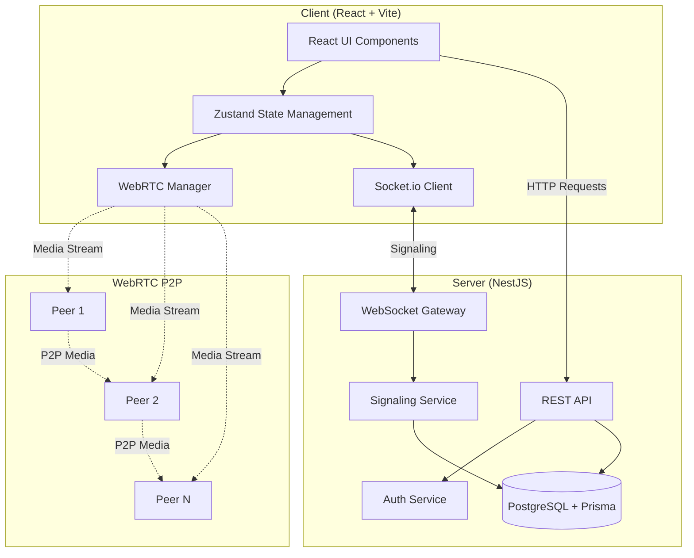
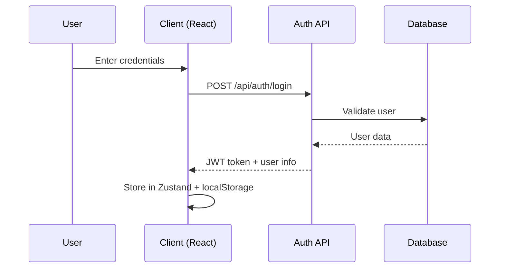
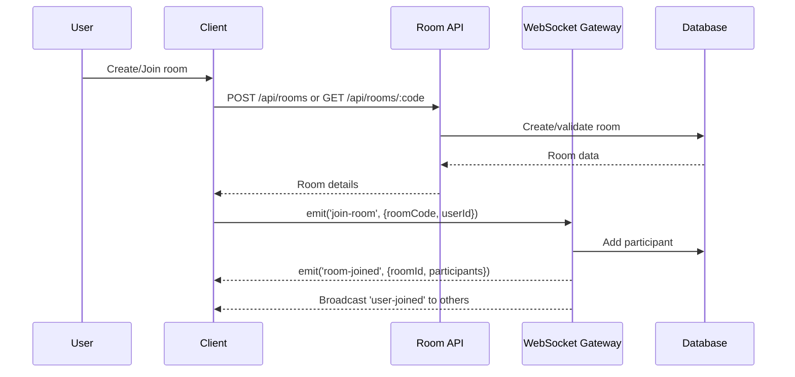
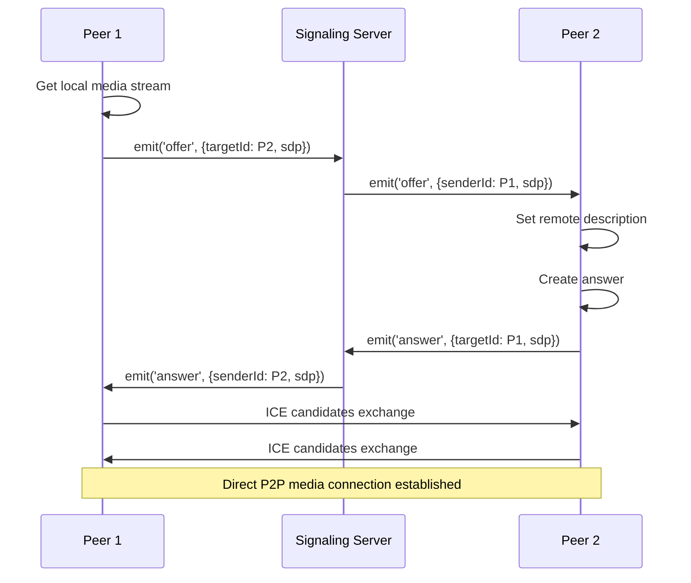

## System Architecture

Neuron Meet is a real-time video conferencing platform built with a modern client-server architecture that leverages WebRTC for peer-to-peer media streaming.

### Architecture Pattern

The system follows a **hybrid architecture**:

- **Client-Server**: Authentication, room management, and signaling
- **Peer-to-Peer (WebRTC)**: Media streaming (audio/video) directly between participants
- **Real-time Communication**: WebSocket-based signaling server for coordination

<Info>
The signaling server (WebSocket) only coordinates connection establishment. Once connected, media flows directly between peers via WebRTC, reducing server bandwidth requirements.
</Info>

## Tech Stack

### Client (Frontend)

| Technology | Purpose | Reference |
|------------|---------|----------|
| **React 18** | UI framework with hooks | client/src/App.tsx:1 |
| **TypeScript** | Type safety | client/package.json:43 |
| **Vite** | Build tool and dev server | client/package.json:44 |
| **React Router** | Client-side routing | client/src/App.tsx:1 |
| **Zustand** | Lightweight state management | client/package.json:25 |
| **TanStack Query** | Server state management | client/package.json:16 |
| **Socket.io Client** | WebSocket communication | client/package.json:23 |
| **Tailwind CSS** | Utility-first styling | client/package.json:42 |
| **Lucide React** | Icon library | client/package.json:19 |

### Server (Backend)

| Technology | Purpose | Reference |
|------------|---------|----------|
| **NestJS** | Node.js framework | server/src/main.ts:2 |
| **TypeScript** | Type safety | server/package.json:58 |
| **Socket.io** | WebSocket server | server/package.json:37 |
| **Prisma** | ORM and database client | server/package.json:29 |
| **PostgreSQL** | Primary database | server/prisma/schema.prisma:9 |
| **Passport + JWT** | Authentication | server/package.json:33-34 |
| **bcrypt** | Password hashing | server/package.json:30 |

### WebRTC Infrastructure

| Component | Purpose | Reference |
|-----------|---------|----------|
| **STUN Servers** | NAT traversal discovery | client/src/lib/webrtc/PeerConnection.ts:24 |
| **TURN Servers** | Media relay (fallback) | .env.example:25-28 |
| **ICE** | Connection establishment | client/src/lib/webrtc/PeerConnection.ts:99 |

<Tip>
Neuron Meet uses Google's free STUN servers by default. For production deployments behind strict firewalls, configure TURN servers via environment variables.
</Tip>

## Component Interaction Flow

### 1. User Authentication Flow

### 2. Room Creation & Join Flow

### 3. WebRTC Media Connection Flow

<Note>
The signaling server's role ends once the peer connection is established. All media (audio/video) flows directly between peers.
</Note>

## Key Components

### Client-Side

#### 1. WebRTC Manager
Manages peer connections, media streams, and ICE negotiation.

**Location**: `client/src/lib/webrtc/PeerConnection.ts:35`

#### 2. Media Manager
Handles local camera, microphone, and screen sharing.

**Location**: `client/src/lib/webrtc/MediaManager.ts:12`

#### 3. Socket Client
WebSocket connection singleton for signaling.

**Location**: `client/src/lib/socket/SocketClient.ts:10`

#### 4. Meeting Store
Centralized state management for active meeting sessions.

**Location**: Zustand store managing participants, streams, and UI state

### Server-Side

#### 1. Signaling Gateway
WebSocket gateway handling real-time events.

**Location**: `server/src/signaling/signaling.gateway.ts:37`

#### 2. Signaling Service
Business logic for room management and participant tracking.

**Location**: `server/src/signaling/signaling.service.ts:22`

#### 3. REST API
Authentication, room CRUD, and persistent data operations.

**Location**: `server/src/main.ts:41`

#### 4. Database Layer
Prisma ORM with PostgreSQL for data persistence.

**Location**: `server/prisma/schema.prisma`

## Data Flow

### Persistent Data (Database)
- User accounts and authentication
- Room metadata and settings
- Participant history
- Chat message history

### Transient Data (In-Memory)
- Active WebSocket connections
- Real-time participant states (muted, video off, etc.)
- Active peer connections
- Media stream references

<Info>
The SignalingService maintains in-memory Maps for tracking active connections, which are cleared when participants disconnect.

**Reference**: server/src/signaling/signaling.service.ts:24-26
</Info>

## Deployment Architecture

### Development Mode
- Client runs on Vite dev server (port 5173)
- Server runs on NestJS (port 3001)
- Separate processes with CORS enabled

**Reference**: server/src/main.ts:16-29

### Production Mode
- Client built as static assets
- Server serves client build and API from single process
- SPA fallback for client-side routing

**Reference**: server/src/main.ts:44-56

## Scalability Considerations

### Current Architecture
- **Single-server deployment**: All components run on one server
- **In-memory state**: Connection state stored in process memory
- **P2P media**: No server bandwidth for media streaming

### Scaling Path
- **Horizontal scaling**: Requires shared state (Redis) for WebSocket connections
- **Media server**: Add SFU (Selective Forwarding Unit) for large meetings
- **Load balancing**: WebSocket sticky sessions required

<Tip>
For meetings with 2-10 participants, pure P2P WebRTC is efficient. For larger meetings (10+), consider adding an SFU like mediasoup or Janus.
</Tip>

## Security Architecture

- **Authentication**: JWT tokens with 7-day expiration
- **Password Security**: bcrypt hashing with salt
- **CORS**: Configured for allowed origins
- **Room Access**: Code-based entry, optional locking
- **WebSocket Auth**: Token validation on connection

**References**:
- server/.env.example:14-15 (JWT config)
- server/src/main.ts:16-29 (CORS)
- server/src/signaling/signaling.service.ts:55-57 (Room locking)

## Related Pages

- [WebRTC Architecture](/architecture/webrtc) - Deep dive into peer connections
- [Signaling Server](/architecture/signaling) - WebSocket event flows
- [Database Schema](/architecture/database-schema) - Data models and relationships