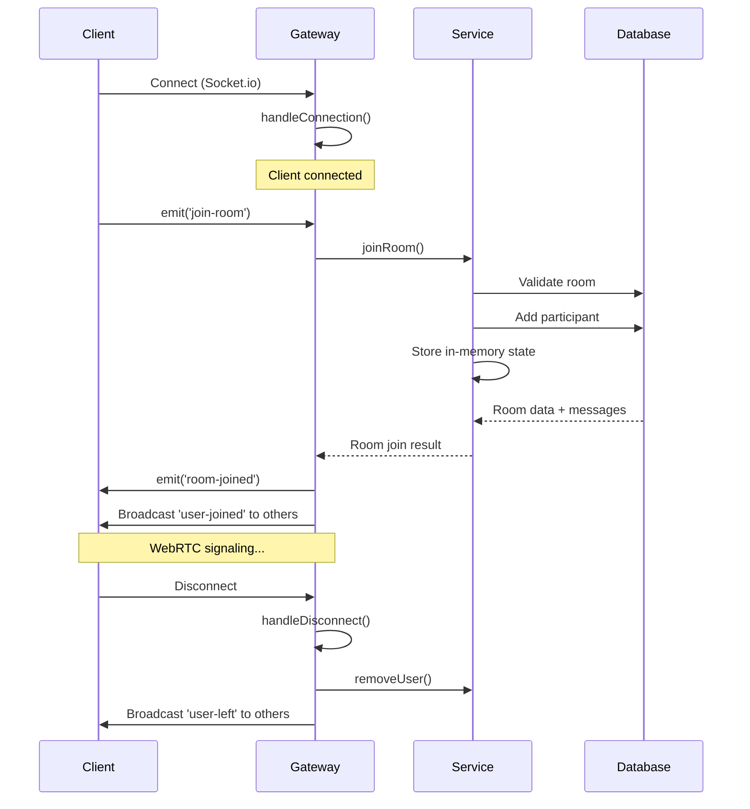
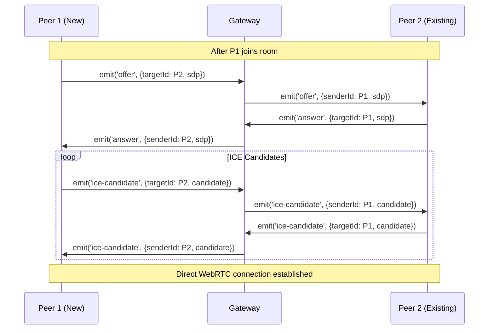

## Overview

The signaling server is responsible for coordinating WebRTC peer connections, managing room state, and facilitating real-time communication between participants. It uses Socket.io for WebSocket communication.

<Info>
The signaling server does NOT handle media streaming. It only exchanges control messages to establish peer-to-peer WebRTC connections.
</Info>

## Architecture Components

### SignalingGateway

The `SignalingGateway` is a NestJS WebSocket gateway that handles incoming socket connections and events.

**Location**: server/src/signaling/signaling.gateway.ts:37

```typescript
@WebSocketGateway({
  cors: {
    origin: "*",
    credentials: true,
  },
  namespace: "/",
})
export class SignalingGateway
  implements OnGatewayConnection, OnGatewayDisconnect
{
  @WebSocketServer()
  server: Server;

  constructor(private signalingService: SignalingService) {}
}
```

### SignalingService

The `SignalingService` contains business logic for room management and participant tracking.

**Location**: server/src/signaling/signaling.service.ts:22

```typescript
@Injectable()
export class SignalingService {
  // In-memory storage for active connections
  private users: Map<string, UserData> = new Map();
  private rooms: Map<string, Set<string>> = new Map();

  constructor(private prisma: PrismaService) {}
}
```

<Note>
Active connection state is stored in-memory for performance. This means the service cannot be horizontally scaled without adding Redis or similar shared state storage.

**Reference**: server/src/signaling/signaling.service.ts:24-26
</Note>

## Connection Lifecycle



### Connection Establishment

**Reference**: server/src/signaling/signaling.gateway.ts:45-47

```typescript
async handleConnection(client: Socket) {
  console.log(`Client connected: ${client.id}`);
}
```

### Disconnection Handling

**Reference**: server/src/signaling/signaling.gateway.ts:49-63

```typescript
async handleDisconnect(client: Socket) {
  console.log(`Client disconnected: ${client.id}`);
  const userData = this.signalingService.getUserData(client.id);

  if (userData) {
    // Notify others in room
    client.to(userData.roomId).emit("user-left", {
      socketId: client.id,
      userId: userData.userId,
    });

    // Clean up
    this.signalingService.removeUser(client.id);
  }
}
```

## Socket Events

### Room Management Events

#### join-room

Client requests to join a room.

**Handler**: server/src/signaling/signaling.gateway.ts:65-149

```typescript
@SubscribeMessage("join-room")
async handleJoinRoom(
  @ConnectedSocket() client: Socket,
  @MessageBody() data: JoinRoomPayload,
) {
  const { roomCode, userId, displayName } = data;
  // ...
}
```

**Payload**:
```typescript
interface JoinRoomPayload {
  roomCode: string;      // Room code to join
  userId?: string;       // Authenticated user ID (optional)
  displayName: string;   // Display name for participant
}
```

**Response Events**:
- `room-joined`: Sent to joining client with room details
- `user-joined`: Broadcast to other participants
- `join-error`: Sent if join fails

**Validation Logic**: server/src/signaling/signaling.service.ts:39-58

```typescript
// Verify room exists and is active
const room = await this.prisma.room.findUnique({
  where: { code: roomCode },
  include: { settings: true },
});

if (!room) {
  throw new Error("Room not found");
}

if (!room.isActive) {
  throw new Error("Room is no longer active");
}

if (room.isLocked) {
  throw new Error("Room is locked");
}
```

<Info>
The service performs defensive cleanup of stale connections before adding new participants to prevent duplicate socket IDs.

**Reference**: server/src/signaling/signaling.service.ts:64-86
</Info>

#### leave-room

Client explicitly leaves a room.

**Handler**: server/src/signaling/signaling.gateway.ts:151-169

```typescript
@SubscribeMessage("leave-room")
handleLeaveRoom(
  @ConnectedSocket() client: Socket,
  @MessageBody() data: { roomId: string },
) {
  const { roomId } = data;
  const userData = this.signalingService.getUserData(client.id);

  if (userData) {
    client.leave(roomId);
    client.to(roomId).emit("user-left", {
      socketId: client.id,
      userId: userData.userId,
    });
    this.signalingService.removeUser(client.id);
  }

  return { success: true };
}
```

### WebRTC Signaling Events

#### offer

Client sends WebRTC SDP offer to another peer.

**Handler**: server/src/signaling/signaling.gateway.ts:172-185

```typescript
@SubscribeMessage("offer")
handleOffer(
  @ConnectedSocket() client: Socket,
  @MessageBody() data: SignalPayload,
) {
  const userData = this.signalingService.getUserData(client.id);

  this.server.to(data.targetId).emit("offer", {
    senderId: client.id,
    userId: userData?.userId,
    displayName: userData?.displayName,
    sdp: data.sdp,
  });
}
```

**Payload**:
```typescript
interface SignalPayload {
  targetId: string;                      // Target peer socket ID
  sdp?: RTCSessionDescriptionInit;      // SDP offer
  candidate?: RTCIceCandidateInit;      // ICE candidate (for ice-candidate event)
}
```

<Note>
The signaling server simply forwards the SDP offer to the target peer. It does not parse or validate the SDP content.
</Note>

#### answer

Client sends WebRTC SDP answer back to the offering peer.

**Handler**: server/src/signaling/signaling.gateway.ts:187-196

```typescript
@SubscribeMessage("answer")
handleAnswer(
  @ConnectedSocket() client: Socket,
  @MessageBody() data: SignalPayload,
) {
  this.server.to(data.targetId).emit("answer", {
    senderId: client.id,
    sdp: data.sdp,
  });
}
```

#### ice-candidate

Client sends ICE candidates for NAT traversal.

**Handler**: server/src/signaling/signaling.gateway.ts:198-207

```typescript
@SubscribeMessage("ice-candidate")
handleIceCandidate(
  @ConnectedSocket() client: Socket,
  @MessageBody() data: SignalPayload,
) {
  this.server.to(data.targetId).emit("ice-candidate", {
    senderId: client.id,
    candidate: data.candidate,
  });
}
```

### WebRTC Signaling Flow



### Media Control Events

#### toggle-audio

Client toggles microphone on/off.

**Handler**: server/src/signaling/signaling.gateway.ts:210-223

```typescript
@SubscribeMessage("toggle-audio")
handleToggleAudio(
  @ConnectedSocket() client: Socket,
  @MessageBody() data: MediaTogglePayload,
) {
  this.signalingService.updateUserMedia(client.id, {
    isMuted: !data.enabled,
  });

  client.to(data.roomId).emit("user-toggle-audio", {
    socketId: client.id,
    enabled: data.enabled,
  });
}
```

**Broadcast**: `user-toggle-audio` event to all other participants

#### toggle-video

Client toggles camera on/off.

**Handler**: server/src/signaling/signaling.gateway.ts:225-238

```typescript
@SubscribeMessage("toggle-video")
handleToggleVideo(
  @ConnectedSocket() client: Socket,
  @MessageBody() data: MediaTogglePayload,
) {
  this.signalingService.updateUserMedia(client.id, {
    isVideoOff: !data.enabled,
  });

  client.to(data.roomId).emit("user-toggle-video", {
    socketId: client.id,
    enabled: data.enabled,
  });
}
```

**Broadcast**: `user-toggle-video` event to all other participants

#### start-screen-share / stop-screen-share

Client starts or stops screen sharing.

**Handler**: server/src/signaling/signaling.gateway.ts:240-264

```typescript
@SubscribeMessage("start-screen-share")
handleStartScreenShare(
  @ConnectedSocket() client: Socket,
  @MessageBody() data: { roomId: string },
) {
  this.signalingService.updateUserMedia(client.id, { isScreenSharing: true });

  client.to(data.roomId).emit("screen-share-started", {
    socketId: client.id,
  });
}
```

**Broadcast Events**:
- `screen-share-started`: When screen sharing starts
- `screen-share-stopped`: When screen sharing stops

### Participant Control Events

#### toggle-hand-raise

Client raises or lowers hand.

**Handler**: server/src/signaling/signaling.gateway.ts:267-284

```typescript
@SubscribeMessage("toggle-hand-raise")
handleToggleHandRaise(
  @ConnectedSocket() client: Socket,
  @MessageBody() data: { roomId: string; raised: boolean },
) {
  const userData = this.signalingService.getUserData(client.id);

  if (data.raised) {
    client.to(data.roomId).emit("user-hand-raised", {
      socketId: client.id,
      displayName: userData?.displayName || "Participant",
    });
  } else {
    client.to(data.roomId).emit("user-hand-lowered", {
      socketId: client.id,
    });
  }
}
```

**Broadcast Events**:
- `user-hand-raised`: When hand is raised
- `user-hand-lowered`: When hand is lowered

### Host Control Events

#### mute-participant

Host forces a participant to mute.

**Handler**: server/src/signaling/signaling.gateway.ts:287-305

```typescript
@SubscribeMessage("mute-participant")
async handleMuteParticipant(
  @ConnectedSocket() client: Socket,
  @MessageBody() data: { roomId: string; targetId: string },
) {
  const userData = this.signalingService.getUserData(client.id);

  if (!userData?.isHost) {
    return { success: false, error: "Not authorized" };
  }

  this.server.to(data.targetId).emit("force-mute", {});
  this.server.to(data.roomId).emit("user-toggle-audio", {
    socketId: data.targetId,
    enabled: false,
  });

  return { success: true };
}
```

**Target Event**: `force-mute` sent to the specific participant

<Info>
Host controls require authorization check. Only the room host (matching `room.hostId`) can perform these actions.

**Reference**: server/src/signaling/signaling.gateway.ts:294
</Info>

#### remove-participant

Host removes a participant from the room.

**Handler**: server/src/signaling/signaling.gateway.ts:307-323

```typescript
@SubscribeMessage("remove-participant")
async handleRemoveParticipant(
  @ConnectedSocket() client: Socket,
  @MessageBody() data: { roomId: string; targetId: string },
) {
  const userData = this.signalingService.getUserData(client.id);

  if (!userData?.isHost) {
    return { success: false, error: "Not authorized" };
  }

  this.server.to(data.targetId).emit("force-disconnect", {
    reason: "Removed by host",
  });

  return { success: true };
}
```

**Target Event**: `force-disconnect` sent to the removed participant

#### lock-room

Host locks or unlocks the room.

**Handler**: server/src/signaling/signaling.gateway.ts:325-343

```typescript
@SubscribeMessage("lock-room")
async handleLockRoom(
  @ConnectedSocket() client: Socket,
  @MessageBody() data: { roomId: string; locked: boolean },
) {
  const userData = this.signalingService.getUserData(client.id);

  if (!userData?.isHost) {
    return { success: false, error: "Not authorized" };
  }

  await this.signalingService.lockRoom(data.roomId, data.locked);

  client.to(data.roomId).emit("room-locked", {
    locked: data.locked,
  });

  return { success: true };
}
```

**Service Method**: server/src/signaling/signaling.service.ts:214-218

```typescript
async lockRoom(roomId: string, locked: boolean): Promise<void> {
  await this.prisma.room.update({
    where: { id: roomId },
    data: { isLocked: locked },
  });
}
```

## State Management

### In-Memory State

The service maintains two in-memory Maps for real-time state:

**Reference**: server/src/signaling/signaling.service.ts:24-26

```typescript
// In-memory storage for active connections
private users: Map<string, UserData> = new Map();
private rooms: Map<string, Set<string>> = new Map();
```

**UserData Interface**: server/src/signaling/signaling.service.ts:4-13

```typescript
export interface UserData {
  socketId: string;
  userId?: string;
  displayName: string;
  roomId: string;
  isHost: boolean;
  isMuted: boolean;
  isVideoOff: boolean;
  isScreenSharing: boolean;
}
```

### State Operations

#### Adding User

**Reference**: server/src/signaling/signaling.service.ts:111-138

```typescript
// Store user data
const userData: UserData = {
  socketId,
  userId,
  displayName,
  roomId: room.id,
  isHost,
  isMuted: false,
  isVideoOff: false,
  isScreenSharing: false,
};
this.users.set(socketId, userData);

// Add to room
if (!this.rooms.has(room.id)) {
  this.rooms.set(room.id, new Set());
}
this.rooms.get(room.id)!.add(socketId);
```

#### Removing User

**Reference**: server/src/signaling/signaling.service.ts:181-191

```typescript
removeUser(socketId: string): void {
  const userData = this.users.get(socketId);
  if (userData) {
    const roomSockets = this.rooms.get(userData.roomId);
    roomSockets?.delete(socketId);
    if (roomSockets && roomSockets.size === 0) {
      this.rooms.delete(userData.roomId);
    }
    this.users.delete(socketId);
  }
}
```

#### Updating Media State

**Reference**: server/src/signaling/signaling.service.ts:202-212

```typescript
updateUserMedia(
  socketId: string,
  updates: Partial<Pick<UserData, "isMuted" | "isVideoOff" | "isScreenSharing">>,
): void {
  const userData = this.users.get(socketId);
  if (userData) {
    Object.assign(userData, updates);
  }
}
```

### Persistent State (Database)

Certain operations are persisted to the database:

1. **Participant Records**: Stored for analytics and history
   - **Reference**: server/src/signaling/signaling.service.ts:130-138

2. **Chat Messages**: Stored for later retrieval
   - **Reference**: server/src/signaling/signaling.service.ts:141-154

3. **Room Locking**: Persisted room state
   - **Reference**: server/src/signaling/signaling.service.ts:214-218

## Socket.io Room Management

Socket.io provides built-in room functionality:

```typescript
// Join a room
client.join(roomData.roomId);

// Leave a room
client.leave(roomId);

// Emit to all in room except sender
client.to(roomId).emit("event-name", data);

// Emit to specific socket
this.server.to(socketId).emit("event-name", data);
```

**Reference**: server/src/signaling/signaling.gateway.ts:96, 160

<Note>
Socket.io rooms are separate from the in-memory `rooms` Map. Socket.io rooms handle message broadcasting, while the Map tracks participant metadata.
</Note>

## Error Handling

### Join Room Errors

**Reference**: server/src/signaling/signaling.gateway.ts:136-148

```typescript
try {
  // ... join logic
  return { success: true, ... };
} catch (error) {
  const message =
    error instanceof Error ? error.message : "Failed to join room";
  console.error("Join room error:", message);
  client.emit("join-error", {
    code: "JOIN_FAILED",
    message,
  });
  return {
    success: false,
    error: message,
  };
}
```

**Error Conditions**:
- Room not found
- Room is locked
- Room is inactive
- Room is full (max participants reached)

## Client Integration

The client uses a `SocketClient` wrapper to interact with the signaling server.

**Location**: client/src/lib/socket/SocketClient.ts:10

**Connection**: client/src/lib/socket/SocketClient.ts:23-72

```typescript
connect(displayName: string): Socket {
  if (this.socket?.connected) {
    return this.socket;
  }

  const { user, token } = useAuthStore.getState();

  this.socket = io(WS_URL, {
    auth: {
      token,
      userId: user?.id,
      displayName: user?.displayName || displayName,
    },
    transports: ["websocket", "polling"],
    reconnection: true,
    reconnectionAttempts: 10,
    reconnectionDelay: 1000,
    reconnectionDelayMax: 5000,
  });
  // ...
}
```

<Info>
Socket.io automatically handles reconnection with exponential backoff. The client maintains meeting state during brief disconnections.

**Reference**: client/src/lib/socket/SocketClient.ts:37-41
</Info>

## Event Summary Table

| Event | Direction | Purpose | Auth Required |
|-------|-----------|---------|---------------|
| `join-room` | Client → Server | Join a meeting room | Optional |
| `leave-room` | Client → Server | Leave a meeting room | No |
| `room-joined` | Server → Client | Confirm room join | N/A |
| `user-joined` | Server → Clients | New participant joined | N/A |
| `user-left` | Server → Clients | Participant left | N/A |
| `offer` | Client → Client (via Server) | WebRTC SDP offer | No |
| `answer` | Client → Client (via Server) | WebRTC SDP answer | No |
| `ice-candidate` | Client → Client (via Server) | ICE candidate | No |
| `toggle-audio` | Client → Server | Toggle microphone | No |
| `toggle-video` | Client → Server | Toggle camera | No |
| `start-screen-share` | Client → Server | Start screen share | No |
| `stop-screen-share` | Client → Server | Stop screen share | No |
| `toggle-hand-raise` | Client → Server | Raise/lower hand | No |
| `mute-participant` | Client → Server | Host mutes participant | Host only |
| `remove-participant` | Client → Server | Host removes participant | Host only |
| `lock-room` | Client → Server | Host locks room | Host only |
| `force-mute` | Server → Client | Force client to mute | N/A |
| `force-disconnect` | Server → Client | Force client to leave | N/A |
| `join-error` | Server → Client | Join failed | N/A |

## Related Pages

- [Architecture Overview](/architecture/overview) - System architecture
- [WebRTC Architecture](/architecture/webrtc) - Peer connection details
- [Database Schema](/architecture/database-schema) - Data persistence