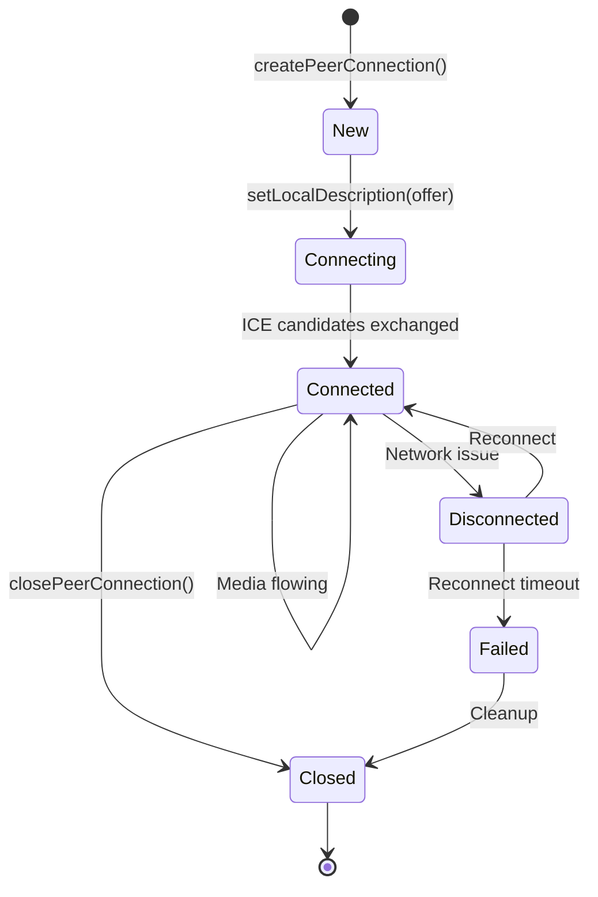

## WebRTC Overview

WebRTC (Web Real-Time Communication) enables peer-to-peer audio and video streaming directly between browsers without server intermediation for media transport.

### Key Concepts

- **Peer Connection**: Direct connection between two participants
- **Media Tracks**: Individual audio or video streams
- **ICE (Interactive Connectivity Establishment)**: NAT traversal protocol
- **SDP (Session Description Protocol)**: Metadata for media capabilities
- **STUN/TURN**: Servers for NAT traversal and relay

## Architecture Components

### PeerConnectionManager

The `PeerConnectionManager` class manages all peer-to-peer connections for a meeting participant.

**Location**: client/src/lib/webrtc/PeerConnection.ts:35

```typescript
export class PeerConnectionManager {
  private peerConnections: Map<string, RTCPeerConnection> = new Map();
  private localStream: MediaStream | null = null;
  private config: PeerConnectionConfig;

  // Callbacks for signaling
  public onIceCandidate?: (peerId: string, candidate: RTCIceCandidate) => void;
  public onRemoteStream?: (peerId: string, stream: MediaStream) => void;
  public onConnectionStateChange?: (peerId: string, state: RTCPeerConnectionState) => void;
}
```

<Info>
Each participant maintains a separate `RTCPeerConnection` for every other participant. In a 4-person meeting, each peer has 3 active peer connections.
</Info>

### MediaManager

The `MediaManager` class handles local media device access and track management.

**Location**: client/src/lib/webrtc/MediaManager.ts:12

```typescript
export class MediaManager {
  private localStream: MediaStream | null = null;
  private screenStream: MediaStream | null = null;

  async getLocalStream(constraints?: MediaConstraints): Promise<MediaStream>
  async startScreenShare(): Promise<MediaStream>
  toggleAudio(enabled: boolean): void
  toggleVideo(enabled: boolean): void
}
```

## ICE Configuration

### STUN Servers

STUN (Session Traversal Utilities for NAT) servers help peers discover their public IP addresses and port mappings.

**Default Configuration**: client/src/lib/webrtc/PeerConnection.ts:24-33

```typescript
const DEFAULT_ICE_SERVERS: RTCIceServer[] = [
  // Google's free STUN servers
  { urls: "stun:stun.l.google.com:19302" },
  { urls: "stun:stun1.l.google.com:19302" },
  { urls: "stun:stun2.l.google.com:19302" },
  { urls: "stun:stun3.l.google.com:19302" },
  { urls: "stun:stun4.l.google.com:19302" },
];
```

<Tip>
STUN servers are used for NAT traversal in most network environments. They work for symmetric NAT and most corporate networks.
</Tip>

### TURN Servers (Optional)

TURN (Traversal Using Relays around NAT) servers relay media when direct peer-to-peer connection fails.

**Configuration**: client/src/lib/webrtc/PeerConnection.ts:6-22

```typescript
const getTurnServers = (): RTCIceServer[] => {
  const turnUrl = import.meta.env.VITE_TURN_URL;
  const turnUsername = import.meta.env.VITE_TURN_USERNAME;
  const turnCredential = import.meta.env.VITE_TURN_CREDENTIAL;

  if (turnUrl && turnUsername && turnCredential) {
    return [
      { urls: turnUrl, username: turnUsername, credential: turnCredential },
      {
        urls: turnUrl.replace("turn:", "turns:").replace(":3478", ":5349"),
        username: turnUsername,
        credential: turnCredential,
      },
    ];
  }
  return [];
};
```

**Environment Variables**: .env.example:25-28

```bash
# TURN Server (optional - for production)
TURN_SERVER_URL=
TURN_USERNAME=
TURN_PASSWORD=
```

<Note>
TURN servers consume significant bandwidth as they relay all media. Only needed for ~10% of connections behind strict firewalls. Popular TURN server providers include Twilio, Xirsys, and self-hosted coturn.
</Note>

## Peer Connection Lifecycle



### 1. Initialization

When a participant joins a room, peer connections are created for existing participants.

**Reference**: client/src/hooks/useWebRTC.ts:165-170

```typescript
// Add existing participants and create offers
data.participants.forEach((p: Participant) => {
  addParticipant(p);
  // Create offer to existing participants
  createOfferForPeer(p.socketId);
});
```

### 2. Creating an Offer

The new participant creates SDP offers for each existing peer.

**Reference**: client/src/lib/webrtc/PeerConnection.ts:132-150

```typescript
async createOffer(peerId: string): Promise<RTCSessionDescriptionInit | null> {
  let pc = this.peerConnections.get(peerId);

  if (!pc) {
    pc = await this.createPeerConnection(peerId);
  }

  try {
    const offer = await pc.createOffer({
      offerToReceiveAudio: true,
      offerToReceiveVideo: true,
    });
    await pc.setLocalDescription(offer);
    return offer;
  } catch (error) {
    console.error("Error creating offer:", error);
    return null;
  }
}
```

### 3. Handling an Offer

The receiving peer creates an SDP answer.

**Reference**: client/src/lib/webrtc/PeerConnection.ts:152-171

```typescript
async handleOffer(
  peerId: string,
  offer: RTCSessionDescriptionInit,
): Promise<RTCSessionDescriptionInit | null> {
  let pc = this.peerConnections.get(peerId);

  if (!pc) {
    pc = await this.createPeerConnection(peerId);
  }

  try {
    await pc.setRemoteDescription(new RTCSessionDescription(offer));
    const answer = await pc.createAnswer();
    await pc.setLocalDescription(answer);
    return answer;
  } catch (error) {
    console.error("Error handling offer:", error);
    return null;
  }
}
```

### 4. ICE Candidate Exchange

Peers exchange ICE candidates to establish the optimal connection path.

**Reference**: client/src/lib/webrtc/PeerConnection.ts:99-103

```typescript
// Handle ICE candidates
pc.onicecandidate = (event) => {
  if (event.candidate) {
    this.onIceCandidate?.(peerId, event.candidate);
  }
};
```

**Reference**: client/src/hooks/useWebRTC.ts:65-70

```typescript
pcManager.current.onIceCandidate = (peerId, candidate) => {
  socketClient.emit("ice-candidate", {
    targetId: peerId,
    candidate: candidate.toJSON(),
  });
};
```

<Info>
ICE candidates represent possible network paths. The WebRTC engine tests all candidates and selects the best one (lowest latency, highest bandwidth).
</Info>

### 5. Connection Established

Once ICE negotiation completes, media tracks are received.

**Reference**: client/src/lib/webrtc/PeerConnection.ts:106-111

```typescript
// Handle remote tracks
pc.ontrack = (event) => {
  const stream = event.streams[0];
  if (stream) {
    this.onRemoteStream?.(peerId, stream);
  }
};
```

## Media Stream Management

### Getting Local Media

**Reference**: client/src/lib/webrtc/MediaManager.ts:16-49

```typescript
async getLocalStream(constraints?: MediaConstraints): Promise<MediaStream> {
  // Reuse existing stream if it's still active
  if (this.localStream && this.localStream.active) {
    const videoTracks = this.localStream.getVideoTracks();
    const audioTracks = this.localStream.getAudioTracks();
    if (videoTracks.length > 0 || audioTracks.length > 0) {
      return this.localStream;
    }
  }

  const defaultConstraints: MediaConstraints = {
    video: {
      width: { ideal: 1280 },
      height: { ideal: 720 },
      facingMode: "user",
    },
    audio: {
      echoCancellation: true,
      noiseSuppression: true,
      autoGainControl: true,
    },
  };

  try {
    this.localStream = await navigator.mediaDevices.getUserMedia(
      constraints || defaultConstraints,
    );
    return this.localStream;
  } catch (error) {
    console.error("Error getting local stream:", error);
    throw error;
  }
}
```

### Audio Processing

Neuron Meet enables audio processing constraints for better call quality:

- **Echo Cancellation**: Prevents audio feedback loops
- **Noise Suppression**: Reduces background noise
- **Auto Gain Control**: Normalizes volume levels

**Reference**: client/src/lib/webrtc/MediaManager.ts:33-37

### Video Quality

Default video resolution is 720p (1280x720). This balances quality and bandwidth.

**Reference**: client/src/lib/webrtc/MediaManager.ts:28-32

<Tip>
For low-bandwidth environments, consider implementing adaptive bitrate by adjusting video constraints based on network conditions.
</Tip>

## Screen Sharing

Screen sharing replaces the video track in peer connections.

### Starting Screen Share

**Reference**: client/src/lib/webrtc/MediaManager.ts:68-89

```typescript
async startScreenShare(): Promise<MediaStream> {
  try {
    this.screenStream = await navigator.mediaDevices.getDisplayMedia({
      video: true,
      // Capturing system/tab audio is a frequent source of echo loops in calls.
      audio: false,
    });

    // Handle when user stops sharing via browser UI
    this.screenStream.getVideoTracks()[0].onended = () => {
      this.stopScreenShare();
      window.dispatchEvent(new CustomEvent("screenshare-ended"));
    };

    return this.screenStream;
  } catch (error) {
    if ((error as Error).name === "NotAllowedError") {
      throw new Error("Screen sharing permission denied");
    }
    throw error;
  }
}
```

### Track Replacement

When screen sharing starts, the camera video track is replaced.

**Reference**: client/src/lib/webrtc/PeerConnection.ts:209-220

```typescript
async replaceVideoTrack(newTrack: MediaStreamTrack): Promise<void> {
  const promises: Promise<void>[] = [];

  this.peerConnections.forEach((pc) => {
    const sender = pc.getSenders().find((s) => s.track?.kind === "video");
    if (sender) {
      promises.push(sender.replaceTrack(newTrack));
    }
  });

  await Promise.all(promises);
}
```

<Note>
Screen sharing audio is disabled by default to prevent echo loops. If enabled, implement acoustic echo cancellation on the receiving end.

**Reference**: client/src/lib/webrtc/MediaManager.ts:72-73
</Note>

## Media Controls

### Muting/Unmuting Audio

**Reference**: client/src/lib/webrtc/MediaManager.ts:118-124

```typescript
toggleAudio(enabled: boolean): void {
  if (this.localStream) {
    this.localStream.getAudioTracks().forEach((track) => {
      track.enabled = enabled;
    });
  }
}
```

### Toggling Video

**Reference**: client/src/lib/webrtc/MediaManager.ts:126-132

```typescript
toggleVideo(enabled: boolean): void {
  if (this.localStream) {
    this.localStream.getVideoTracks().forEach((track) => {
      track.enabled = enabled;
    });
  }
}
```

<Info>
Toggling track.enabled mutes locally without renegotiating peer connections. The track continues flowing but sends silence/black frames.
</Info>

## Connection Monitoring

### Connection State Changes

**Reference**: client/src/lib/webrtc/PeerConnection.ts:114-121

```typescript
// Monitor connection state
pc.onconnectionstatechange = () => {
  this.onConnectionStateChange?.(peerId, pc.connectionState);

  // Clean up failed connections
  if (pc.connectionState === "failed" || pc.connectionState === "closed") {
    this.closePeerConnection(peerId);
  }
};
```

### Connection States

- **new**: Just created, no ICE processing yet
- **connecting**: ICE candidates being exchanged
- **connected**: Successfully connected, media flowing
- **disconnected**: Connection temporarily lost (e.g., network switch)
- **failed**: Connection failed permanently
- **closed**: Connection closed intentionally

## Performance Considerations

### Bandwidth Usage

For a 720p video call:
- **Video**: ~1-2 Mbps per peer
- **Audio**: ~50-100 Kbps per peer
- **Total**: In a 4-person meeting, each peer sends 1 stream and receives 3 streams (~3-6 Mbps down, 1-2 Mbps up)

### CPU Usage

WebRTC encoding/decoding is hardware-accelerated when available:
- **Modern devices**: Negligible CPU usage
- **Older devices**: May struggle with multiple 720p streams

<Tip>
For better performance on low-end devices, implement simulcast (sending multiple quality levels) or consider switching to an SFU architecture.
</Tip>

## Troubleshooting

### Connection Issues

1. **ICE Connection Failed**: Usually NAT/firewall issues
   - Solution: Configure TURN servers
   - Check firewall allows UDP traffic

2. **No Audio/Video**: Permission or device issues
   - Check browser permissions
   - Verify device availability
   - Check for conflicts with other apps

3. **One-Way Audio/Video**: Asymmetric NAT
   - Solution: TURN server required

### Debug Tools

Chrome DevTools provides WebRTC internals:
- Navigate to `chrome://webrtc-internals/`
- View connection stats, ICE candidates, and bandwidth usage

## Integration with Signaling

WebRTC requires a signaling channel to exchange connection metadata. Neuron Meet uses Socket.io for this.

**Key Events**:
- `offer`: Send SDP offer to peer
- `answer`: Send SDP answer to peer
- `ice-candidate`: Exchange ICE candidates

**Reference**: See [Signaling Architecture](/architecture/signaling) for details.

## Related Pages

- [Architecture Overview](/architecture/overview) - System architecture
- [Signaling Server](/architecture/signaling) - WebSocket signaling flow